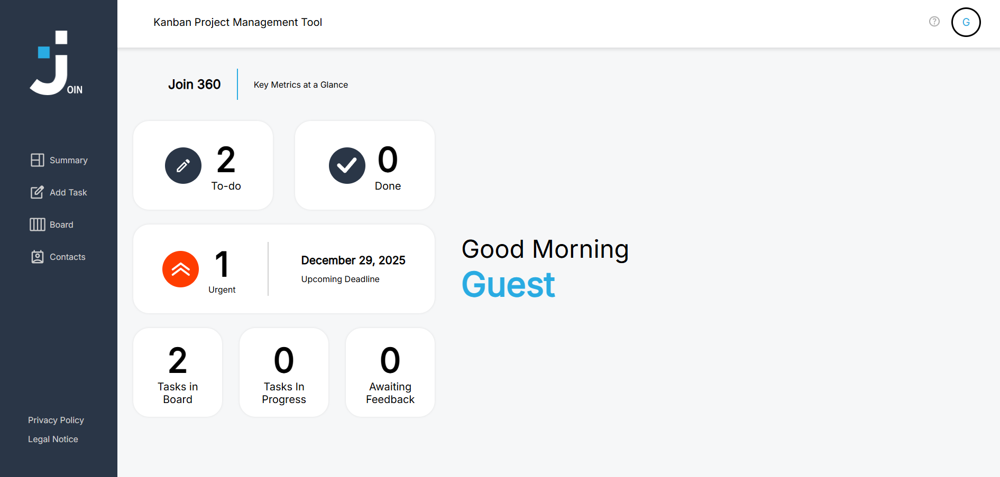

# JOIN - KANBAN PROJECT MANAGEMENT TOOL



Join is a Kanban-based project management tool designed to help teams and individuals organize tasks efficiently. Inspired by tools like Trello, it allows users to manage tasks across different phases, assign contacts, and track progress visually.

This application is built with Angular 19 and uses Firebase as a backend-as-a-service (BaaS) for real-time database interactions and authentication.


## LIVE DEMO

View the live application here:
https://adminhype.github.io/joinKanban/

**Note:** You can use the "Guest Log in" button to test the application without registration.


## KEY FEATURES

- Kanban Board: Organize tasks into "To Do", "In Progress", "Await Feedback", and "Done".
- Drag & Drop: Move tasks between status columns intuitively.
- Task Management: Create, edit, and delete tasks with details like due dates, priority, subtasks, and categories.
- User Authentication: Secure Sign up, Log in, and Guest access via Firebase Authentication.
- Contact Management: Add and edit contacts to assign them to specific tasks.
- Responsive Design: Optimized layout for desktop, tablet, and mobile devices.


## TECHNOLOGY STACK

- Frontend: Angular 19 (Standalone Components, Signals, RxJS)
- Language: TypeScript, HTML5, SCSS
- Backend / Database: Firebase Firestore (NoSQL)
- Authentication: Firebase Auth
- Hosting: GitHub Pages
- Version Control: Git


## LOCAL DEVELOPMENT SETUP

If you want to run this project locally, follow these steps:

### 1. Clone the repository
```
git clone https://github.com/adminhype/joinKanban.git
```
### 2. Install dependencies
   Navigate to the project folder and install the necessary npm packages:
```
cd joinKanban
```
```
npm install
```
### 3. Start the development server
   Run the application locally:
```
ng serve
```
   Open your browser and navigate to http://localhost:4200/. The application will automatically reload if you change any of the source files.


## CONFIGURATION

This project uses Firebase for data storage and authentication. The environment configuration files are included in the repository to ensure the demo works out-of-the-box.

Security Note: The Firebase API keys visible in the source code are public by design (client-side keys). They are secured via Domain Restrictions in the Google Cloud Console, allowing access only from localhost and the specific GitHub Pages URL.


## CONTRIBUTORS
This project was created as a group effort by:

[Adem](https://github.com/adminhype)
[Burak](https://github.com/DevMinded55)
[Robin](https://github.com/Ch1charito)
[Muhammad](https://github.com/alchaafan)